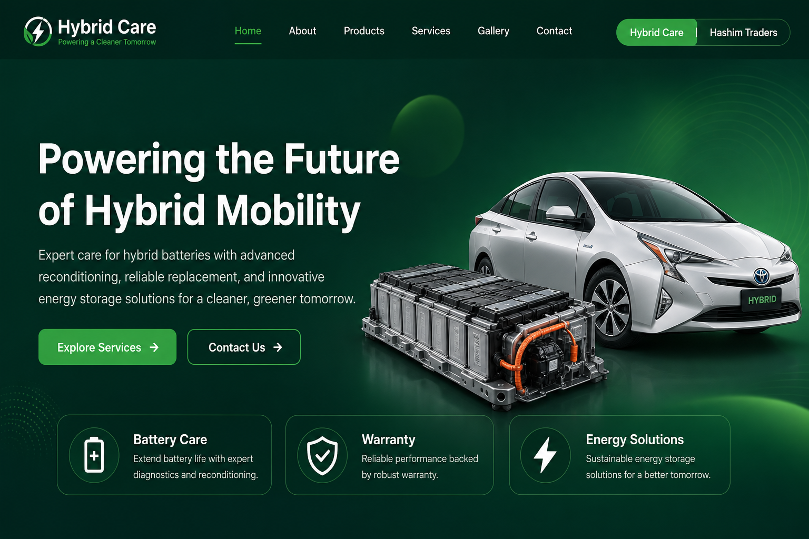
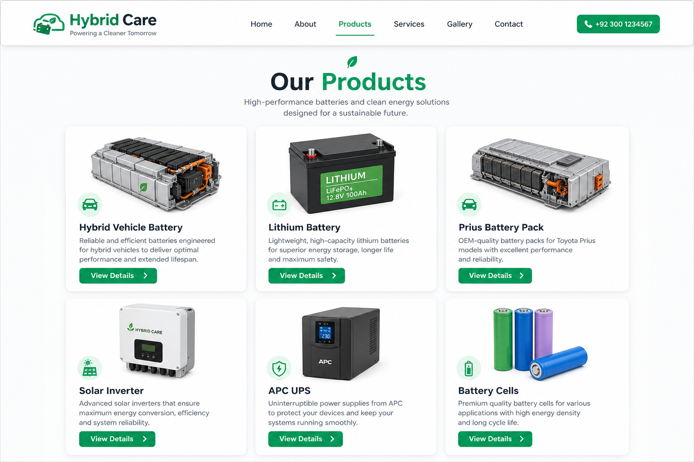

<div align="center">

# Hybrid Care

**A multi‑business web platform for hybrid‑vehicle battery care & clean‑energy services** — built with React + TypeScript on a shared, data‑driven codebase.


</div>

---

## Overview

**Hybrid Care** is a responsive, animated marketing/catalog site for a hybrid‑vehicle battery and energy business. It's **multi‑business by design**: the same codebase powers two brand profiles — **Hybrid Care** and **Hashim Traders** — switchable at runtime, with each brand's content (products, services, theme) driven entirely from data files.

## Screens

<div align="center">

<br/><br/>

<br/>
<sub>Home hero with brand switcher · Data‑driven products catalog</sub>
</div>

## Features

- **Multi‑business, data‑driven** — swap brand profile/content (Hybrid Care ⇄ Hashim Traders) via a `BusinessContext`; products, services and theming come from JSON/data files, not hard‑coded layout.
- **Full marketing site** — Home, About, Products, Services, Gallery, Contact, and a landing page, wired with **React Router**.
- **Product & service catalogs** — hybrid batteries, lithium batteries, Prius packs, UPS units, solar inverters, and installation/diagnostic services.
- **Polished motion** — **Framer Motion** animations and **Swiper** carousels, mobile‑first responsive design.
- **Themed per brand** — Tailwind theme tokens (green energy palette for Hybrid Care, blue for Hashim Traders) with the Poppins type family.

## Tech stack

| Area | Tech |
|------|------|
| Framework | React 18 + TypeScript |
| Build | Vite |
| Styling | Tailwind CSS, Poppins |
| Animation | Framer Motion, Swiper |
| Routing | React Router |
| Icons | lucide‑react |

## Project layout

```
src/
├── components/    layout (Header, Footer, BusinessSwitcher) + home (Hero)
├── context/       BusinessContext (active brand)
├── data/          products/services/businesses (JSON + TS) per brand
├── pages/         Home, About, Products, Services, Gallery, Contact, Landing
└── assets/        logos, product & service illustrations (SVG)
```

## Getting started

```bash
npm install
npm run dev        # start dev server
npm run build      # production build
npm run preview    # preview the build
```

---

<sub>One data‑driven React codebase, two brands — hybrid‑vehicle battery care & energy services.</sub>
